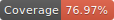
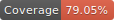
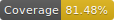
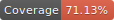

# Caldera Processor UI
Caldera Forms processor user interface generator and components.

[](https://travis-ci.org/calderawp/processor-ui)

[](https://calderalabs.org/processor-ui/badge.svg)

|Statements|Lines|Functions|Branches|
|---|---|---|---|
|||||
🌋 👀 [Documentation](https://calderalabs.org/caldera-npm-module-boilerplate/)

### Usage

```js
import React, {Component} from 'react';
import './App.css';
import CalderaProcessorsUI from '@caldera-labs/processor-ui';
import {Provider} from 'react-redux';

class App extends Component {

	constructor(props){
		super(props);
		this.state = {
			store: CalderaProcessorsUI.processorsStore
		}
	}
	componentDidMount() {
		//Add processors from remote API or local json or hard code like in this example
		//dispatch() is documented at https://www.npmjs.com/package/@wordpress/data#dispatch-storename-string--object
		this.state.store.dispatch(
			//setProcessorType() is documented at https://calderalabs.org/processor-ui/function/index.html#static-function-setProcessorType
			CalderaProcessorsUI.actions.setProcessorType(
				//processorType definition
				{
				    TYPE: 'superProcessor', //identifier for processor
				    LABEL: 'Super ', //Human readable label for processor
				    defaultConfigFields: [] //configuration fields. https://calderalabs.org/caldera-components/manual/factories.html#configfield-schema 
			    	},
			    	'superProcessor' //identifier for processor
			)
		);

	}

	render() {
		return (
			<div className="caldera-forms-processors">
				<Provider store={this.state.store}>
					<CalderaProcessorsUI.CalderaProcessorsWithState/>
				</Provider>

			</div>
		);
	}
}
```


## Install
`npm i -D @caldera-labs/prcoessors-ui`

### Development Requirements
* [npm](https://www.npmjs.com/get-npm)
* [Yarn](https://yarnpkg.com/lang/en/docs/install/#mac-stable)
* [Git]()


## Scripts

### Develop
* `yarn start`
    - Runs linter and compiles for development
    - Starts test app server

### Build for release
This script is run as part of release commands. There is no need to run it manually most of the time.

This script calls a pre, compile, and post subcommands.  For consistency, please call other scripts at those three events.

* `yarn build`
    - Runs tests and compiles.
    

### Tests
We use [Facebook Jest](https://facebook.github.io/jest/) for unit tests. Test go in the directory `__tests__`.

* `yarn test`
    - Run test watcher
* `yarn test:once` 
    - Run tests once


### Lint Code
Code style is enforced using [eslint](https://eslint.org/)

* `yarn lint`
    - Run linter and fixer watch
* `yarn lint:fix`
    - Lint and fix code once
* `yarn lint:once`
    - Lint code once


### Generate Documentation
* `npm run documentation`
    - Generates documentation from inline docs
    - Generates documentation from markdown files in /manual

### Release To npm
Must be [logged in as project maintainer via npm cli](https://docs.npmjs.com/cli/adduser)

* `yarn release`
    - Release a patch update
    - Increments third position of a version. 1.0.1 -> 1.0.2
* `yarn release:minor`
    - Release a minor update
    - Increments second position of a version. 1.0.1 -> 1.1.0 
* `yarn release:major`
    - Release a major update
    - Increments second position of a version. 1.0.1 -> 2.0.0 
    
These commands run the tests and linter, and if they pass, re-compiles source, rebuilds docs, updates the version using [npm version](https://docs.npmjs.com/cli/version), adds a git tag, makes a git commit for the version change and updates the module on npm.
